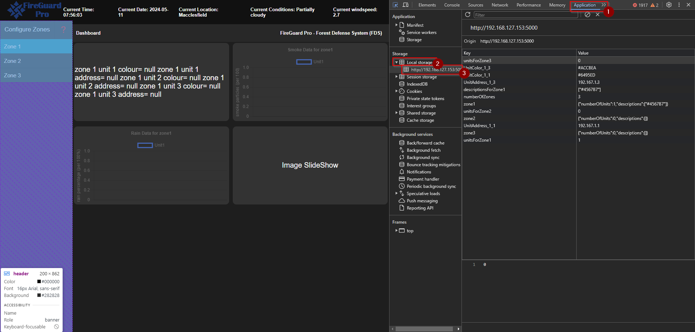

# Development Notes from 11th May 2024

## Dashboard Local Storage

The dashboard stores data about the number of zones and units in the LocalStore.
[Local store](https://www.freecodecamp.org/news/use-local-storage-in-modern-applications)

### Viewing the data in the LocalStore (Chrome)

- Open Development Tools in the browser (F12)
- Click Application tab
- Expand Local storage
- Expand IP address 

### Local Store Data Keys

- numberOfZones
- `${StorageKeyUnitColor}_${zoneNumber}_${unitNumber}` eg UnitColor_1_1
- `${StorageKeyUnitAddress}_${zoneNumber}_${unitNumber}` eg UnitAddress_1_1
