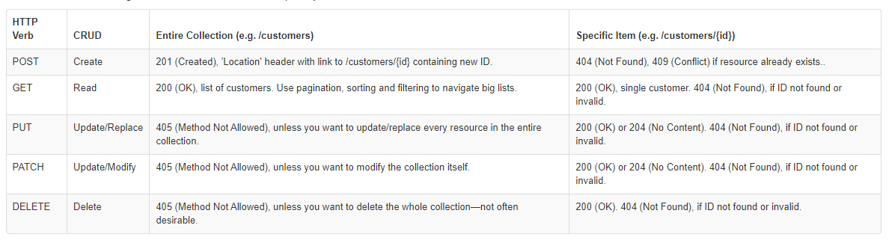

# Development Notes

## Using HTTP Methods for RESTful Services

The HTTP verbs comprise a major portion of our “uniform interface” constraint and provide us the action counterpart to the noun-based resource. The primary or most-commonly-used HTTP verbs (or methods, as they are properly called) are POST, GET, PUT, PATCH, and DELETE. These correspond to create, read, update, and delete (or CRUD) operations, respectively. There are a number of other verbs, too, but are utilized less frequently. Of those less-frequent methods, OPTIONS and HEAD are used more often than others.

https://www.restapitutorial.com/lessons/httpmethods.html

## Testing flask

https://flask.palletsprojects.com/en/3.0.x/testing/

