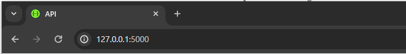
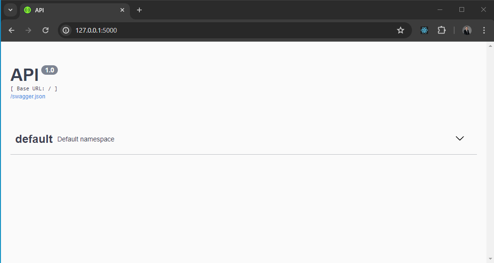
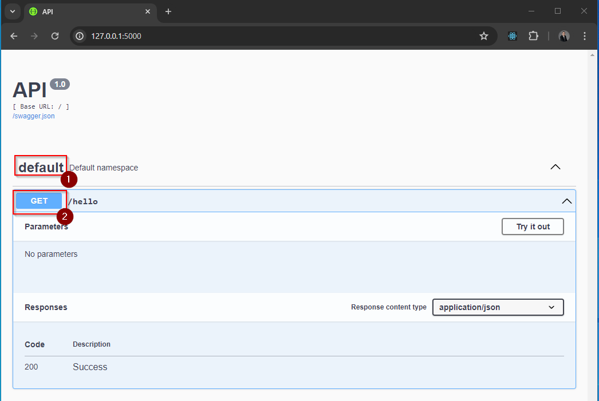
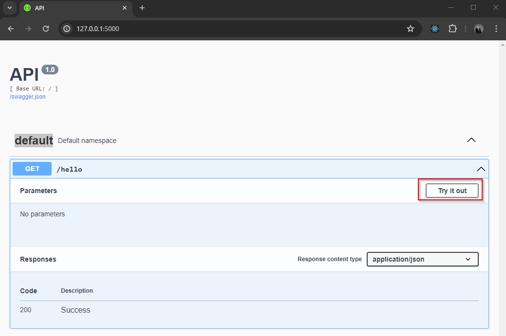
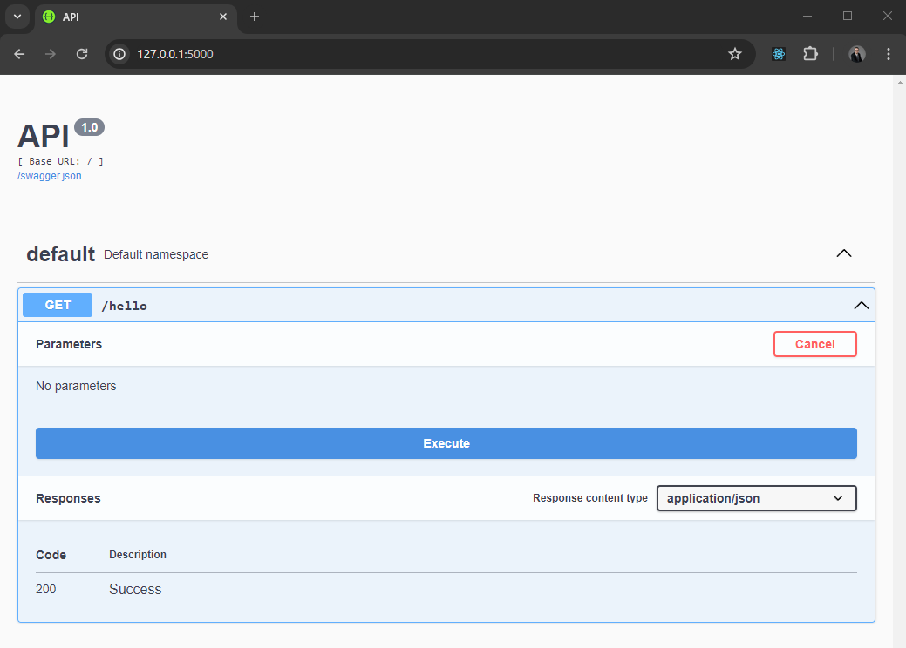
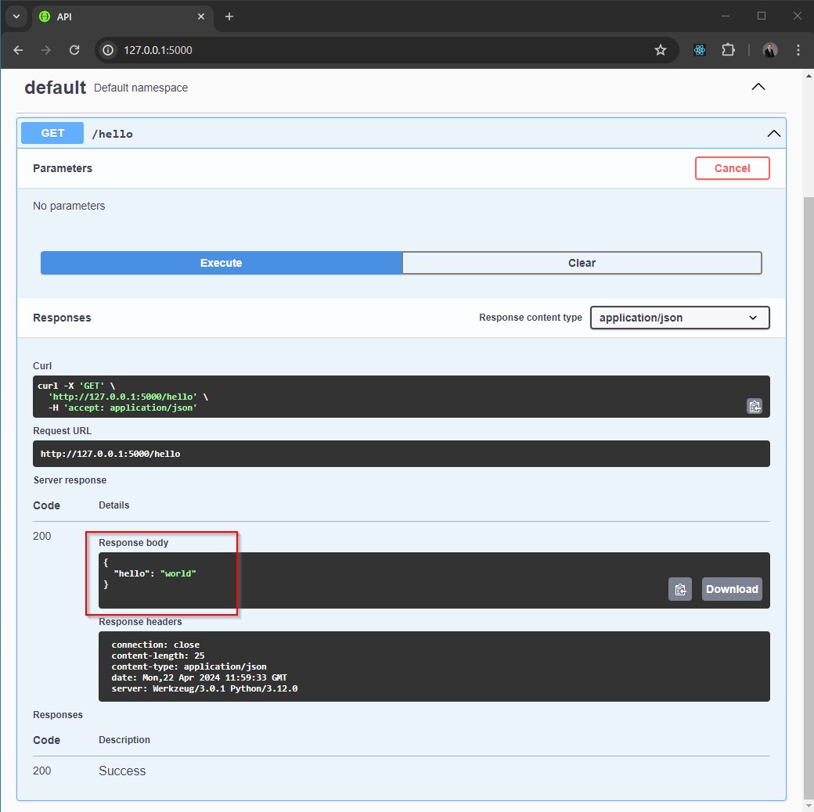

# Development Notes From 22 April 2024

## Installation

1. Install Flask-RESTX with pip

```bash
pip install flask-restx
```

## Getting Started

The getting started example is a simple application that helps to confirm the system is correct and working.

1. Create a text file called `firmware.py` and add the following code to create a simple Flask-RESTX API.

```py
from flask import Flask
from flask_restx import Resource, Api

app = Flask(__name__)
api = Api(app)

@api.route('/hello')
class HelloWorld(Resource):
    def get(self):
        return {'hello': 'world'}

if __name__ == '__main__':
    app.run(debug=True)
```

2. From the command prompt, run the Python code using the command `python firmware.py`

3. In the console logs, look for the message that starts with `Running on`.


4. Enter the address from the `running on` log message into a web browser. Typically the address is http://127.0.0.1:5000


5. The webpage should show the default view.


6. Click `default` to expand the endpoint, click `get` to expand the get hello end point. 


7. Click `Try it out` button 


8. Click `Execute` button. 


9. The response for the endpoint is shown in the response body. 



